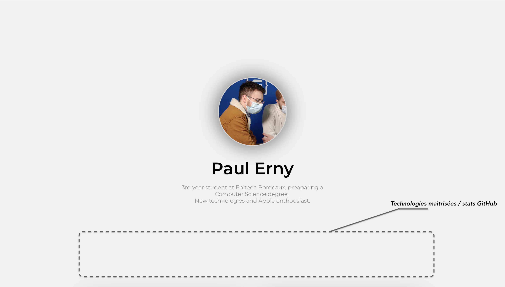

# portfolio

A simple portfolio website made in reactJS and animated with [react-spring](https://www.react-spring.io) where I'll put some of my projects.

### How to get a preview ?

This website will soon be availible on a custom domain name and hosted by github pages.

While it is still in development, you may see it by cloning the source files
> `git clone git@github.com:PaulErny/portfolio.git`

Navigating to the folder containing the react app
> `cd portfolio/portfolio-front`

Starting the development server
> `npm start`
>
> *Make sure that you have **node** and **react** installed*

Once the development server is up and running, open your web navigator of choice and navigate to [localhost:3000](http://localhost:3000)

### Current state
Since this website if to be hosted by GitHub Pages (temporarily) there can be no routing. Therefore, this portoflio is only composed of a landing page.

On this pic, I've added the upcomming additions.

When scrolling down, you will land on this view :

This list of projects is built out of a JSON file that decide the size, color and content of each widget so that when the portfolio will be hosted on a proper server, the front will already be ready for its data to be sent to it by the back end.

In the upcomming future, the widgets will be made clickable and animated to that the user can click on a widget to see it on full screen mode and access more details on the project.
